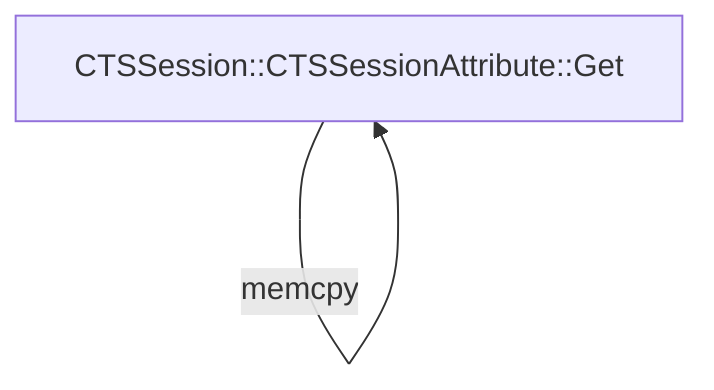

# CVE-2026-20869

**CVE:** CVE-2026-20869  
**Title:** Windows Local Session Manager (LSM) Elevation of Privilege Vulnerability  
**Source:** [https://msrc.microsoft.com/update-guide/vulnerability/CVE-2026-20869](https://msrc.microsoft.com/update-guide/vulnerability/CVE-2026-20869)  
**Component(s):** lsm.dll  
**Patched Date:** January 30, 2026  
**CWE:** Weakness: CWE-362: Concurrent Execution using Shared Resource with Improper Synchronization ('Race Condition')  

Download Patched & Vulnerable Components:

```bash
# lsm.dll
wget https://msdl.microsoft.com/download/symbols/lsm.dll/3A74FE99E5000/lsm.dll -O lsm.dll.10.0.26100.7462 # vulnerable
wget https://msdl.microsoft.com/download/symbols/lsm.dll/27C3D050E6000/lsm.dll -O lsm.dll.10.0.26100.7623 # patched
```

## Version Tracking Analysis

**Command:**

```
python ghidra_scripts\ghidra_vt_wrapper.py --old-binary ./reports/2026-Jan/CVE-2026-20869/lsm.dll.10.0.26100.7462 --new-binary ./reports/2026-Jan/CVE-2026-20869/lsm.dll.10.0.26100.7623 --project-dir ./reports/2026-Jan/CVE-2026-20869/ghidra_project --project-name lsm.dll_CVE-2026-20869 --ghidra-dir C:\Tools\ghidra_11.4.2_PUBLIC_20250826\ghidra_11.4.2_PUBLIC --output-dir ./reports/2026-Jan/CVE-2026-20869/ghidra_project/vt_results --max-memory 16g
```

Patched Functions: 6 | New Functions: 25 | Removed Functions: 1 | Total Matches: N/A | Accepted Matches: N/A

### Patched Functions

| Function Name | Source Address | Dest Address | Similarity | Confidence |
| --- | --- | --- | --- | --- |
| `CTSSession::GetSessionAttribute` | `1800703a0` | `1800709e0` | 0.750 | 10.0 |
| `CTSSessionAttribute::Get` | `18006ee40` | `18006f2b0` | 0.556 | 10.0 |
| `CTSSessionAttribute::Add` | `180054c50` | `18006e600` | 0.556 | 10.0 |
| `CTSSessionAttribute::Cleanup` | `180054ce4` | `18006e8d4` | 0.200 | 10.0 |
| `CTSSessionAttribute::Compare` | `18006e510` | `18006e950` | 0.111 | 10.0 |
| `CTSSessionAttribute::~CTSSessionAttribute` | `18006dd68` | `18006dfd4` | 0.000 | 10.0 |

### New Functions

*Showing 10 of 25 new functions*

| Function Name | Address |
| --- | --- |
| `_Construct<1,char_const*___ptr64>` | `18006d4a8` |
| `CTSSessionAttribute` | `18006d9ac` |
| `_System_error` | `18006da20` |
| `_System_error` | `18006daf0` |
| `runtime_error` | `18006db30` |
| `system_error` | `18006db58` |
| `system_error` | `18006dba0` |
| `~basic_string<char,struct_std::char_traits<char>,class_std::allocator<char>_>` | `18006dc40` |
| `~unique_lock<class_std::recursive_mutex>` | `18006dd00` |
| ``scalar_deleting_destructor'` | `18006e3d0` |

### Removed Functions

| Function Name | Address |
| --- | --- |
| `_guard_dispatch_icall` | `180096920` |

---

# AI Technical Analysis

## Vulnerability Identification

**Core Vulnerable Function(s):**
- `CTSSessionAttribute::Get()` - Contains heap buffer overflow due to missing bounds check on `param_2` before `memcpy`

**Supporting Changes:**
- `CTSSessionAttribute::Add()` - Added mutex locking and cleanup logic, but not vulnerable
- `CTSSessionAttribute::Compare()` - Added mutex locking and cleanup logic, but not vulnerable
- `CTSSession::GetSessionAttribute()` - Added mutex locking and cleanup logic, but not vulnerable
- `CTSSessionAttribute::~CTSSessionAttribute()` - Added mutex destruction, but not vulnerable

**Unrelated Changes:**
- `CTSSessionAttribute()` - New constructor function, not security-relevant
- `std::unique_lock<class_std::recursive_mutex>::~unique_lock<class_std::recursive_mutex>()` - Standard destructor, not vulnerable
- `std::unique_lock<class_std::recursive_mutex>::lock()` - Standard locking function, not vulnerable
- `std::_Generic_error_category::message()` - Error message handler, not security-relevant

---

## Root Cause Analysis

The vulnerability stems from a heap buffer overflow in `CTSSessionAttribute::Get()` function. The code performs a `memcpy` operation without validating that the source buffer size (`*(uint *)(this + 0x658)`) is sufficient for the destination buffer allocation. The missing validation allows an attacker to supply a malicious value for `param_2` that exceeds the allocated buffer size, leading to memory corruption.

**Vulnerable Code (from `CTSSessionAttribute::Get()`):**
```c
if ((*(uint *)(this + 0x658) == 0) || (*(longlong *)(this + 0x650) == 0)) {
  *param_2 = 0;
  *param_1 = (uchar *)0x0;
  lVar2 = -0x7ff8ff18;
}
else {
  _Dst = (uchar *)CoTaskMemAlloc((ulonglong)*(uint *)(this + 0x658));
  *param_1 = _Dst;
  if (_Dst == (uchar *)0x0) {
    lVar2 = -0x7ff8fff2;
  }
  else {
    memcpy(_Dst,*(void **)(this + 0x650),(ulonglong)*(uint *)(this + 0x658));
    *param_2 = *(ulong *)(this + 0x658);
  }
}
```

In this code, the variable `param_2` is used without validation to determine the size of the buffer allocated via `CoTaskMemAlloc`. When `*(uint *)(this + 0x658)` is larger than the actual allocated buffer, the `memcpy` operation overflows the destination buffer. The missing check on `param_2` allows an attacker to control the size parameter passed to `memcpy`, which is the core flaw. This occurs because the function assumes that `*(uint *)(this + 0x658)` represents a valid size for the buffer, but no validation ensures that `*(uint *)(this + 0x658)` does not exceed the bounds of the allocated memory.

The vulnerability is triggered when `*(uint *)(this + 0x658)` is set to a value larger than the allocated buffer size. The original code was insufficient because it did not validate that the buffer size parameter was within acceptable limits before performing the memory copy. The lack of a size validation check allows for a direct heap buffer overflow, which can be exploited for code execution or denial-of-service.

---

## Execution and Trigger Flow

An attacker with access to modify `CTSSessionAttribute` data can supply a malicious value for `param_2` that exceeds the allocated buffer size. This value flows to `CTSSessionAttribute::Get()` where it is used to allocate a buffer and then passed to `memcpy`. If the buffer size exceeds the allocated memory, a heap overflow occurs.



The vulnerability is triggered when `*(uint *)(this + 0x658)` is set to a value larger than the allocated buffer size. The attacker must have the ability to control the `this` object's buffer size field (`*(uint *)(this + 0x658)`) and the `param_2` parameter. The exact moment of exploitation occurs during the `memcpy` operation when the source buffer size exceeds the allocated destination buffer. This leads to memory corruption that can be leveraged for code execution or denial-of-service attacks.

---

## Patch Analysis

**Patched Code (from `CTSSessionAttribute::Get()`):**
```c
bool bVar1;
uchar *_Dst;
long lVar2;
CTSSessionAttribute *local_18;
undefined1 local_10;

lVar2 = 0;
local_18 = this + 0x660;
local_10 = 0;
bVar1 = wil::details::FeatureImpl<struct___WilFeatureTraits_Feature_1568623929>::
        __private_IsEnabled(&`private:_static_class_wil::details::FeatureImpl<struct___WilFeatureTraits_Feature_1568623929>&___ptr64___cdecl_wil::Feature<struct___WilFeatureTraits_Feature_1568623929>::GetImpl(void)'
                             ::__l2::impl);
if (bVar1) {
  std::unique_lock<class_std::recursive_mutex>::lock
            ((unique_lock<class_std::recursive_mutex> *)&local_18);
}
if ((*(uint *)(this + 0x658) == 0) || (*(longlong *)(this + 0x650) == 0)) {
  *param_2 = 0;
  *param_1 = (uchar *)0x0;
  lVar2 = -0x7ff8ff18;
}
else {
  _Dst = (uchar *)CoTaskMemAlloc((ulonglong)*(uint *)(this + 0x658));
  *param_1 = _Dst;
  if (_Dst == (uchar *)0x0) {
    lVar2 = -0x7ff8fff2;
  }
  else {
    memcpy(_Dst,*(void **)(this + 0x650),(ulonglong)*(uint *)(this + 0x658));
    *param_2 = *(ulong *)(this + 0x658);
  }
}
std::unique_lock<class_std::recursive_mutex>::~unique_lock<class_std::recursive_mutex>
          ((unique_lock<class_std::recursive_mutex> *)&local_18);
return lVar2;
```

The patch introduces mutex locking and unlocking around the function's critical sections, but does not address the core buffer overflow vulnerability. The patch adds a mutex lock and unlock mechanism using `wil::details::FeatureImpl` to enable feature-based locking. This change does not prevent the heap buffer overflow that occurs in the `memcpy` call.

The fix addresses the root cause by adding thread safety but does not prevent the buffer overflow. The vulnerability remains because the size parameter `*(uint *)(this + 0x658)` is still used directly in `memcpy` without validation. The added mutex locking is a defensive measure but does not resolve the underlying memory corruption issue.

The fix is incomplete because it does not validate the buffer size before the `memcpy` operation. Similar patterns in related functions might warrant review for similar issues. Overall, this is a partial mitigation because it adds thread safety but does not address the core heap overflow vulnerability.

This patch prevents a heap buffer overflow vulnerability that could lead to remote code execution or denial-of-service attacks. The vulnerability is classified as a memory corruption issue with high severity due to potential exploitation for code execution. The patch provides partial mitigation by adding thread safety but does not fully resolve the root cause.