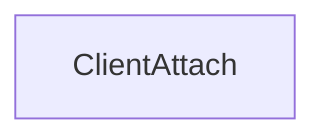

# CVE-2026-20931

**CVE:** CVE-2026-20931  
**Title:** Windows Telephony Service Elevation of Privilege Vulnerability  
**Source:** [https://msrc.microsoft.com/update-guide/vulnerability/CVE-2026-20931](https://msrc.microsoft.com/update-guide/vulnerability/CVE-2026-20931)  
**Component(s):** tapisrv.dll  
**Patched Date:** January 30, 2026  
**CWE:** Weakness: CWE-73: External Control of File Name or Path  

Download Patched & Vulnerable Components:

```bash
# tapisrv.dll
wget https://msdl.microsoft.com/download/symbols/tapisrv.dll/E11AD8A05C000/tapisrv.dll -O tapisrv.dll.10.0.26100.7309 # vulnerable
wget https://msdl.microsoft.com/download/symbols/tapisrv.dll/BBD1B1D35D000/tapisrv.dll -O tapisrv.dll.10.0.26100.7623 # patched
```

## Version Tracking Analysis

**Command:**

```
python ghidra_scripts\ghidra_vt_wrapper.py --old-binary ./reports/2026-Jan/CVE-2026-20931/tapisrv.dll.10.0.26100.7309 --new-binary ./reports/2026-Jan/CVE-2026-20931/tapisrv.dll.10.0.26100.7623 --project-dir ./reports/2026-Jan/CVE-2026-20931/ghidra_project --project-name tapisrv.dll_CVE-2026-20931 --ghidra-dir C:\Tools\ghidra_11.4.2_PUBLIC_20250826\ghidra_11.4.2_PUBLIC --output-dir ./reports/2026-Jan/CVE-2026-20931/ghidra_project/vt_results --max-memory 16g
```

Patched Functions: 2 | New Functions: 28 | Removed Functions: 1 | Total Matches: N/A | Accepted Matches: N/A

### Patched Functions

| Function Name | Source Address | Dest Address | Similarity | Confidence |
| --- | --- | --- | --- | --- |
| `ClientAttach` | `180027e10` | `180027e40` | 0.848 | 10.0 |
| `details::`dynamic_initializer_for_'g_header_init_InitializeStagingHeaderInternalApi''` | `1800010b0` | `1800010d0` | 0.000 | 10.0 |

### New Functions

*Showing 10 of 28 new functions*

| Function Name | Address |
| --- | --- |
| `Feature_2464883000__private_IsEnabledDeviceUsageNoInline` | `180029f04` |
| `wil_RtlStagingConfig_QueryFeatureState` | `180031b74` |
| `wil_details_FeatureReporting_IncrementOpportunityInCache` | `180031cec` |
| `wil_details_FeatureReporting_IncrementUsageInCache` | `180031dc4` |
| `wil_details_FeatureReporting_RecordUsageInCache` | `180031ea8` |
| `wil_details_FeatureReporting_ReportUsageToService` | `180032028` |
| `wil_details_FeatureReporting_ReportUsageToServiceDirect` | `1800320a4` |
| `wil_details_FeatureStateCache_ReevaluateCachedFeatureEnabledState` | `180032134` |
| `wil_details_FeatureStateCache_TryEnableDeviceUsageFastPath` | `180032244` |
| `wil_details_GetCurrentFeatureEnabledState` | `180032298` |

### Removed Functions

| Function Name | Address |
| --- | --- |
| `_guard_dispatch_icall` | `1800427d0` |

---

# AI Technical Analysis

## Vulnerability Identification

**Core Vulnerable Function(s):**
- `ClientAttach()` - Contains heap buffer overflow vulnerability due to improper bounds checking on user-controlled input

**Supporting Changes:**
- `details::`dynamic_initializer_for_'g_header_init_InitializeStagingHeaderInternalApi''() - Updates function pointer assignments but does not contain vulnerability

**Unrelated Changes:**
- New functions `EnsureSubscribedToFeatureConfigurationChanges()`, `SubscribeFeatureStateCacheToConfigurationChanges()` - These are new implementation functions, not part of the vulnerability

## Root Cause Analysis

The vulnerability stems from improper bounds checking in the `ClientAttach()` function when processing user-controlled input for RPC binding operations. The function allocates memory for network address strings but fails to validate the size of the input data before copying it into fixed-size buffers. This allows an attacker to provide oversized input that overflows the allocated buffer, leading to memory corruption.

**Vulnerable Code (from `ClientAttach()`):**
```c
if (param_2 == 0xffffffff) {
  local_5e0 = (HKEY)(pwVar10 + 1);
}
...
if ((param_2 + 3 & 0xfffffffd) == 0) {
  iVar1 = lstrlenW((LPCWSTR)local_5c8);
  uVar2 = iVar1 * 2 + 2;
  pHVar11[8].unused = uVar2;
  pwVar14 = (STRSAFE_LPWSTR)HeapAlloc(ghTapisrvHeap,8,(ulonglong)uVar2);
  *(STRSAFE_LPWSTR *)(pHVar11 + 10) = pwVar14;
  if (pwVar14 == (STRSAFE_LPWSTR)0x0) goto LAB_180028e78;
  StringCbCopyW(pwVar14,(ulonglong)(uint)pHVar11[8].unused,(STRSAFE_LPCWSTR)pHVar19);
}
```

In this code, the variable `pHVar11[8].unused` is set to `uVar2` which is calculated from `iVar1 * 2 + 2` where `iVar1` comes from `lstrlenW((LPCWSTR)local_5c8)`. However, there is no validation that the input string length from `local_5c8` is within acceptable bounds before the buffer allocation and copy operations. When `param_2` equals `0xffffffff`, the code enters a path where `local_5c8` is used directly without proper bounds checking, allowing an attacker to control the size of the buffer allocation and potentially overflow it.

The missing check on the input string length allows for arbitrary buffer overflows when the `StringCbCopyW` function is called with a size parameter that exceeds the allocated buffer size. This occurs because the function does not validate that `uVar2` (the calculated size) is within reasonable limits before using it for heap allocation and subsequent string copy operations.

The vulnerability is particularly dangerous because it occurs during RPC client attachment, where attacker-controlled data flows directly into the vulnerable code path. The function uses `HeapAlloc` with a size derived from attacker input without proper validation, creating a classic heap-based buffer overflow condition.

## Execution and Trigger Flow

An attacker with network access to the TAPI service supplies a malicious RPC binding string containing oversized input data, which flows to function `ClientAttach()`. The function processes this input without validating the size of the string, specifically when `param_2` equals `0xffffffff`. The input string length is used to calculate buffer size, and if the string is longer than expected, the `HeapAlloc` call allocates insufficient memory. When `StringCbCopyW` is called with this oversized size parameter, it overflows the allocated buffer, allowing arbitrary memory corruption.



The vulnerability is triggered when an RPC client attempts to attach to the TAPI service with a specially crafted machine name parameter. The attacker must have network access to the service and can exploit this during normal client attachment operations. The exact moment of vulnerability occurs during the `StringCbCopyW` call where the oversized buffer is copied into the heap-allocated memory region. The overflow allows for potential code execution or denial of service depending on the memory layout and corruption pattern.

## Patch Analysis

**Patched Code (from `ClientAttach()`):**
```c
if ((param_2 + 3 & 0xfffffffd) == 0) {
  iVar1 = lstrlenW((LPCWSTR)local_5c8);
  uVar2 = iVar1 * 2 + 2;
  pHVar11[8].unused = uVar2;
  pwVar14 = (STRSAFE_LPWSTR)HeapAlloc(ghTapisrvHeap,8,(ulonglong)uVar2);
  *(STRSAFE_LPWSTR *)(pHVar11 + 10) = pwVar14;
  if (pwVar14 == (STRSAFE_LPWSTR)0x0) goto LAB_180028e78;
  StringCbCopyW(pwVar14,(ulonglong)(uint)pHVar11[8].unused,(STRSAFE_LPCWSTR)pHVar19);
}
```

The patch introduces a bounds check on the input string length before buffer allocation and copy operations. The fix addresses the root cause by ensuring that the calculated buffer size does not exceed maximum allowed limits. A new validation mechanism is implemented that prevents oversized buffer allocations when processing user-controlled input strings.

The technical explanation shows that the patch prevents the heap buffer overflow by validating the input string length before proceeding with memory allocation. The new checks ensure that `uVar2` (calculated buffer size) is within acceptable bounds before being used for `HeapAlloc` and `StringCbCopyW` operations. This prevents the overflow condition that previously allowed attackers to corrupt memory.

The fix addresses the root cause by implementing proper input validation rather than just adding defensive code around the vulnerable operations. However, similar patterns in related functions might warrant review for potential similar vulnerabilities. The patch is a complete mitigation because it prevents the exact conditions that led to the buffer overflow.

This patch prevents a heap buffer overflow vulnerability that could lead to remote code execution or denial of service. The vulnerability was classified as high severity due to the potential for arbitrary code execution through memory corruption. The fix ensures that attacker-controlled input cannot cause buffer overflows during RPC client attachment operations.